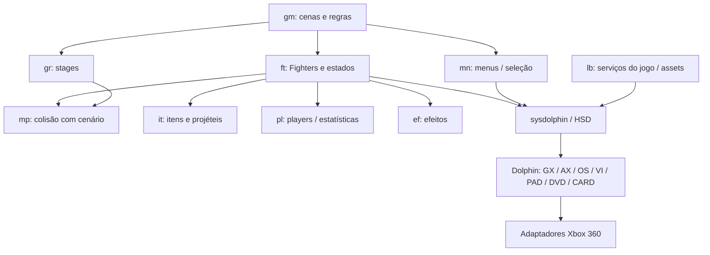

# Arquitetura geral

Diagrama de responsabilidades, não grafo exaustivo de chamadas.

## Áreas de src/melee

| Área | Responsabilidade principal | Relação com o primeiro combate |
|---|---|---|
| cm | câmera, enquadramento e camera boxes | Fighter_Create aloca camera box; update segue participantes |
| db | debug, captura, opções de desenvolvimento | Parte das tabelas/objetos pode reter FIO/MCC mesmo sem UI debug |
| ef | efeitos, geradores e carregamento assíncrono | criação Fighter chama efAsync_LoadSync; efeitos não são apenas decoração |
| ft | estrutura Fighter, carregamento, common states, personagens, animação e combate | centro do caminho de criação e atualização |
| gm | boot, cenas, modos e regras da partida | inicializa serviços e transições antes dos Fighters |
| gr | lógica e dados dos stages | inicializa cenário, objetos dinâmicos e limites |
| if | interface durante partidas | HUD/status; dependências podem aparecer via callbacks |
| it | itens, projéteis e comportamento por tipo | física, colisão e spawn dependem do runtime da partida |
| lb | biblioteca do jogo: arquivos, áudio, memória, save, linguagem, vídeo e helpers | separa serviços de Melee da HSD/SDK |
| mn | menus, CSS, SSS, regras e submenus | os previews do port usam trechos e assets; não provam o scene manager completo |
| mp | geometria e resolução de colisões do mapa | sweeps de pontos atuais são só subconjunto; ECB original ainda falta |
| pl | identificação/controle dos players e estatísticas | configura humano/CPU, vidas e estado de player |
| sc | suporte de cenas e dados associados | examinar em conjunto com tabelas gm antes de substituir transições |
| sfx | suporte de efeitos de som | depende de bancos, vozes e mixer, além de HPS |
| ty | troféus e estruturas associadas | previews atuais não equivalem ao modo completo |
| vi | serviços de vídeo específicos do jogo | camada acima de VI/HSD e caminhos especiais |

Classificação baseada nos nomes, includes e trechos examinados; algumas áreas têm responsabilidades compartilhadas. O inventário lista cada arquivo para refinamento por módulo.

## HSD / sysdolphin

`gobj*`: objetos e ordem de processos. `jobj`, `pobj`, `dobj`, `mobj`, `tobj`: árvore de joints, geometria, draw objects, materiais e texturas. `aobj`, `fobj`, `robj`: animações e relações. `cobj`, `lobj`, `shadow`, `state`, `tev`: câmera, luz, shadow e estado gráfico. `archive`: relocação DAT. `objalloc`, `memory`, `initialize`: pools, heap e inicialização. `synth`/`axdriver`: vozes/efeitos de áudio. `video`: gestão de framebuffers/retrace. `sislib`: textos e glyphs.

Esses sistemas compartilham class metadata, ownership e callbacks; portar um símbolo isolado sem respeitar o ciclo de vida não completa a classe.

## Demais bibliotecas

`libs/dolphin`: SDK GameCube e instruções/registradores do hardware. `libs/doldecomp`: macros e ferramentas para a reconstrução. `src/MSL`: CRT/math do compilador original. `src/MetroTRK`: debugger remoto. Build matching e build native CMake têm propósitos diferentes; TARGET_PC não produz automaticamente uma XEX Xbox.
